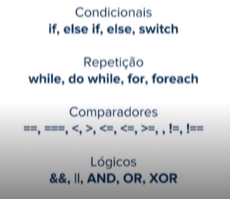
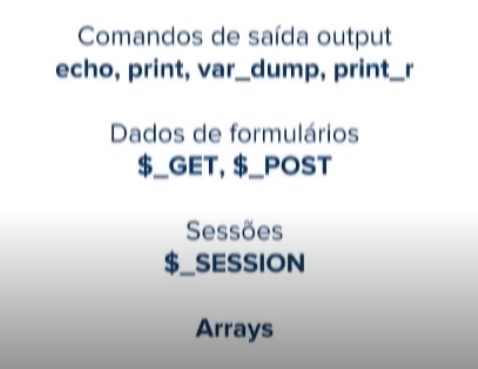
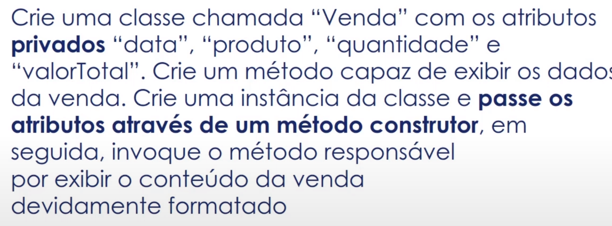
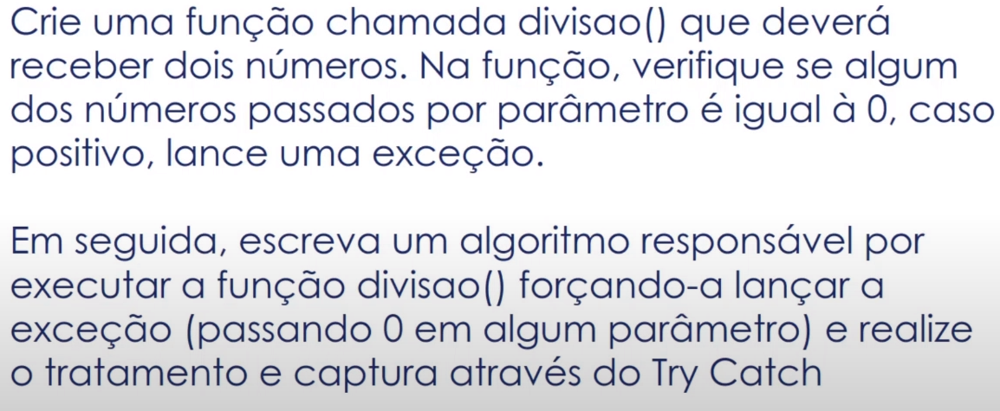
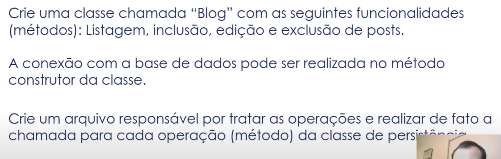

# Introdução ao PHP Moderno

- PHP é uma linguagem Back-end server side (Processamento da solicitação do lado do servidor.) de scripts 
- a partir da versão 5 começa o PHP a ser OO 
- interpretado e multiparadigma (Porque ele suporta uma grande variedade técnica e de paradigmas de programação.)
- Xampp e lampp 
- lambda function 
- php standarts 
- frameworks , middlewares 
- mantido pela azend 
- zendframework 
- vou usar o docker

- acerte o arquivo .env

- renomeie as pastas do projeto no docker-compose.yml
- abrir outro VScode e executar o docker-compose up para manter o server online e ter acesso a ele em linha de comando 

- acerte o gitignore
```
/docker
.devcontainer
.env
docker-compose.yml
Makefile
```
- inicie o docker 
- apt-get install git
- attach ao php 
- localhost:89 

Qual é, respectivamente, uma das características de Requests e Responses?
Estado do servidor e tamanho do Buffer.

Quais das ferramentas abaixo não é citada pelo professor como sendo de PHP:
Ferramentas para design.

Leia as sentenças e assinale a alternativa correta.
I - PHP é uma linguagem open source, gerenciada pela empresa Zend.
II – É obrigatório realizar a instalação do Apache para a utilização do PHP.
III - O HTML é fundamental para desenvolver a linguagem PHP.
Apenas I está correta.


# Ecossistema PHP (CMS e Frameworks)

- Sistemas para gerenciamento de conteúdo 

- CMS wordpress, drupal , magento , october 

- mais de 50% da web ainda eh php 

-  Frameworks : symfony zend laravel cake phalcon  

- ambiente : apache ou ngnix 

- qquer uma a partir da 7 

- comando phpinfo();

- criamos public/index.php e public/info.php

```JS 
<?php

phpinfo();
```

# sintaxe e fundamentos 





- print  saida formatada 
- var_dump informações internas sobre o valor 
- 

# Criando um projeto Simples 


# Aprenda na prática como utilizar o método de requisição e resposta na web com PHP


``` JS
<!DOCTYPE html>
<html lang="en">
    <head>
        <meta charset="UTF-8">
        <title>Formulario</title>

        <meta name= "author" content=""></head>
        <meta name= "description" content="">
        <meta name="viewport" content="width=device-width, initial-scale=1.0">
    </head>
<body>
    <p>Formulario para inscricao</p>
    <!-- get envia por query string na barrade endereco -->
    <!-- http://localhost:89/script.php?nome=21321&idade=12312 -->
    <form action="script.php" method="post">
    <p> Seu nome: <input type="text" name="nome" /> </p>
    <p> Sua idade: <input type="text" name="idade" /> </p>
    <p><input type="submit"></p>
    </form>
</body>
</html>
```
``` Js 
<?php

// tipagem dinamica igual js 
$categorias =[];
$categorias[] = 'infantil';
$categorias[] = 'adolescente';
$categorias[] = 'adulto';
$categorias[] = 'idoso';

// recupera a informaçõa que vem por post 
$nome = $_POST['nome'];
$idade = $_POST['idade']; 

// $nome = $_GET['nome'];
// $idade = $_GET['idade']; 


//  var_dump($nome);
//  var_dump($idade);

if($idade>=6 && $idade <=12 )
{
    echo 'infantil'; 
}
else if ( $idade>=13 && $idade <=18 ) 
{
    echo 'adolescente'; 
}
else {
    echo 'adulto'; 
}
// for ($i=0; $i < count($categorias) ; $i++) 
// { 
//     if($categorias[$i] =='infantil')
//         echo "O nadador ", $nome , " compete na categoria " ,$categorias[$i]; 
// }
?>
```
função com retorno bool 

```Js
function ValidaNome (string $nome) : bool 
{
    return true ;
}
```
faz a tipagem ser mais restritiva 

declare ('strict_type-1'); 

controle de erro : @ 

interromper ao encontrar uma falha require ()

Verifica se existe  e está setada isset()

unset elimina o que estiver setado 

- está separando por servicos :

- um para validar os dados 
- uma para mensagens por sessão 
- um para categoriacompetidor 

- include "arquivo ou diretorio"

- redireciona para uma nova localidade 
header ('location:index.php') 


# Orientações a objetos, exceções e banco de dados PHP 

- Classes 
- Propriedades 
- Modificadores de Acesso 
- Métodos 


# Classes 

- Representação de um objeto 
- Possui métodos e atributos (ou propriedades)

# Visibilidade - Modificadores de acesso 
- public , private e protected
- public    - todos acessam 
- private   - só a classe acessa 
- protected - a classe e as que herdam acessam 

- Saldo não pode ser public senao qquer um pode modificar , deve ser alterado somente por um metodo deposito ou retirada

# Métodos 

- Açoes para uma classe e conceito de método construtor 

- construtor - executado quando criamos uma instancia da classe 

- 1 arquivo por classe (instancia nao deve ficar no mesmo arquivo )



- php vem ficando cada vez mais tipado 

- declare(strict_types=1);

# Datas e exceções em PHP 

- DateTime 
- Formatação 
- Manipulação 

- função date () 
- ver arquivo dateas.php


# Exceções em PHP

- Classe Exception 
- Capturando exceções try-catch finally
- message, code, file, line



# Manipulando BD em PHP 

- PHP funciona com relacionais e nao relacionais 

- mysqli  no manual tem todas os métodos utilizados 

- PDO - PHP DATA OBJECTS 
- camada de abstração para BD 
- tanto faz o banco 
- usando os métodos permanece o mesmo independente do BD 

# CRUD em PDO 

- tive que acertar o connect.php para poder usa-lo com docker : 
- usei o phpinfo(); para achar meu $_SERVER['REMOTE_ADDR'] que era   172.19.0.1 e adicionei a porta do mysql 
- $pdo = new PDO('mysql:host=172.19.0.1;port=3306;dbname=exemplo','root', 'glw2e3');
- http://localhost:89/connect.php

- default-mysql-client 

- ou rodar mysql -h 172.19.0.1 -u root -p exemplo < /application/public/script.sql

http://localhost:89/connect.php
http://localhost:89/list.php
http://localhost:89/insert.php?descricao=Produto%20Teste2
http://localhost:89/update.php?descricao=Produto%20Teste%20Alterado&id=1
http://localhost:89/delete.php?id=1

# Refatorando para usar uma unica classe 



# Desenvolvimento avançado em PHP 

# Trabalkhando com composer  e phpunit 

- nada de includes e requires desnecessários , utiliza bibliotecas especialists 
- a instalação do composer é feita usando um arquivo .phar (executavel do php análogo ao jar do java)
- pode ser colocado no path ou usando como script 
```
    https://getcomposer.org/download/
    php -r "copy('https://getcomposer.org/installer', 'composer-setup.php');"
    php -r "if (hash_file('sha384', 'composer-setup.php') === '756890a4488ce9024fc62c56153228907f1545c228516cbf63f885e036d37e9a59d27d63f46af1d4d07ee0f76181c7d3') { echo 'Installer verified'; } else { echo 'Installer corrupt'; unlink('composer-setup.php'); } echo PHP_EOL;"
    php composer-setup.php
    php -r "unlink('composer-setup.php');"
```
mv composer.phar /usr/local/bin/composer

- vamos desenvolver uma biblioteca para consulta de cep 

- composer init (para criar o pacote)
- nome da empresa ou do pacote 
- stable 
- biblioteca : consumida por outros projetos 
- projeto : framework ex: pacote  
- metapacote (pacote que nao tem codigo php  reune uma lista de dependecias )
- composer-plugin : plugin do composer 
- podemos submeter nosso package para o packagist , basta entrar no site logado criar uma tag para seu pacote no git e mandar para o packagist que ele estará disponível para a comunidade 


# PHP Unit 

- testes unitários em php 

- TDD primeiro monta o cenário e depois faz a codificação (isso é TDD) vc cria a  função após criar o teste 

- podemos gerar um relatório no code covered 

- pelo menos 90% de cobertura com testes 

- https://phpunit.de/ 

- composer require --dev phpunit/phpunit ^9

- ./vendor/bin/phpunit --version

- criou uma pasta testes 
- criou um arqivo SearchTest.php 

```Js
<?php 

use PHPUnit\Framework\TestCase;
use pastasprojeto\Search

class SearchTest extends TestCase{
    /**
    * @dataProvider dadosTeste
    */ 
    public function testgetAddressFromZipCodeDefaultUsage(string $input, array $esperado){
        $resultado = new Search; 
        $resultado = $resultado-> getAddressFromZipCode($input);
        $this->assertsEquals($esperado,$resultado); 
    }
    public function dadosTeste() {
    return [
        "endereço 1 "=> [
            "010011000", 
            [
                "dado"=> "chave",
                "dado"=> "chave",
                "dado"=> "chave",
                "dado"=> "chave",
                "dado"=> "chave"
            ]
        ],
        "endereço 2"=> [
            "010011000", 
            [
                "dado"=> "chave",
                "dado"=> "chave",
                "dado"=> "chave",
                "dado"=> "chave",
                "dado"=> "chave"
            ]
        ]

    ]
    }
}   

?>

```

- vendor/bin/phpunit tests/ --colors=always

- php unit datasourse
- @dataprovider bom para testar vários cenários 
- gerando o code coverage 
- vendor/bin/phpunit tests/ --colors=always --testdox-text=report-tests.txt

- vendor/bin/phpunit tests/ --colors=always --testdox-text=report-tests.txt --coverage-html=_report --whitelist=src/


